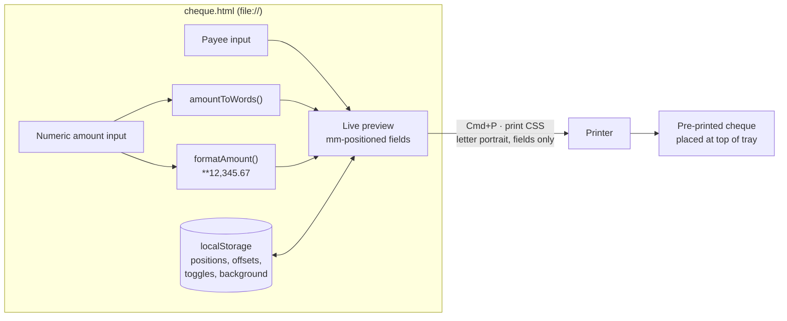
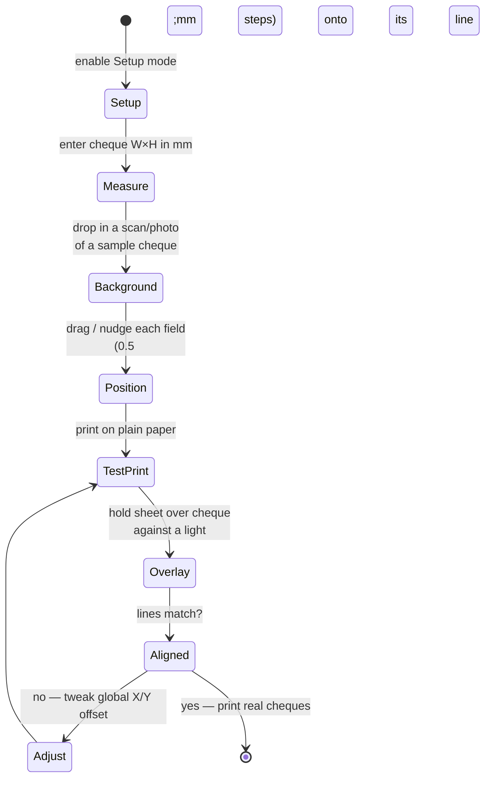

# cheque-writer

A local, zero-dependency tool for printing the **payee**, **amount in words**, and
**numeric amount** onto pre-printed bank cheques. Open one HTML file, type two
values, print. The amount in words is generated from the numeric amount, so the two
can never disagree — a mismatch between words and figures is the classic reason a
bank bounces a cheque.

> **Status:** design approved, implementation in progress. See
> [`docs/superpowers/specs/2026-07-05-cheque-layout-design.md`](docs/superpowers/specs/2026-07-05-cheque-layout-design.md).

## How it works



Only the three text strings reach paper — the form, the cheque outline, and the
calibration background image are all hidden by print CSS.

## Usage

1. Open `cheque.html` in a browser (no server needed).
2. Type the payee and the numeric amount. The words line renders live:
   `12345.67` → *Twelve Thousand Three Hundred Forty-Five Pesos and 67/100 Only*.
3. Place a cheque in the printer tray where the top edge of a letter sheet feeds.
4. Cmd+P with **margins: None**, **scale: 100%**, **headers/footers: off**.

The date is handwritten by design — it is not printed.

## One-time calibration

Positions are stored in millimetres and persist in `localStorage`, so this is done
once per chequebook format.



## Amount-in-words rules (PH convention)

| Input      | Output                                                          |
|------------|-----------------------------------------------------------------|
| `12345.67` | Twelve Thousand Three Hundred Forty-Five Pesos and 67/100 Only  |
| `500`      | Five Hundred Pesos Only                                         |
| `1`        | One Peso Only                                                   |
| `0.50`     | Zero Pesos and 50/100 Only                                      |

- Range 0.01 – 999,999,999.99; input rounded to 2 decimals first.
- The numeric field prints with an asterisk guard by default: `**12,345.67`.
- Invalid amounts (zero, negative, overflow, NaN) block printing entirely.

## Development

Pure logic is test-driven with Node's built-in runner — no dependencies:

```sh
node --test
```

Physical positioning is verified with the paper-overlay test print above; there are
no browser-automation tests for a single static page whose calibration loop is
inherently physical.

## Project structure

```
cheque-writer/
├── cheque.html                  # entire UI + print CSS
├── amount-to-words.js           # pure functions (browser global + module.exports)
├── tests/
│   └── amount-to-words.test.js  # node --test
└── docs/superpowers/specs/      # design spec
```
